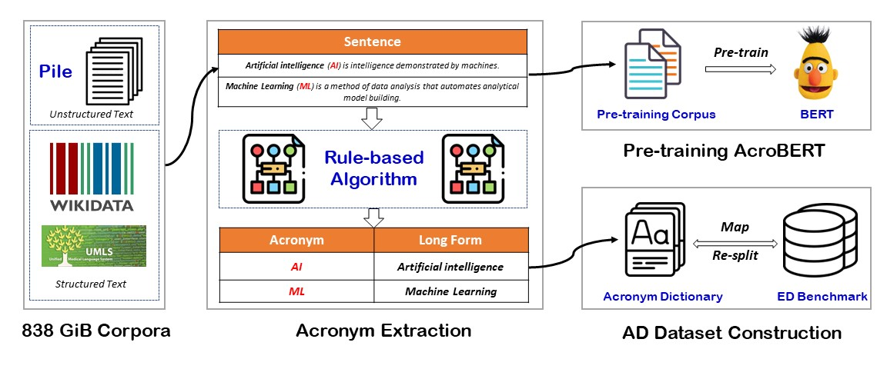

# GLADIS
GLADIS: A General and Large Acronym Disambiguation Benchmark (Long paper at EACL 23)



To accelerate the research on acronym disambiguation, we constructed a new benchmark named GLADIS and the pre-trained AcroBERT:

|  | Source  | Desc |
|------|------------|------|
| [Acronym Dictionary](https://zenodo.org/record/7568937#.Y9JiQXaZNPY) | [Pile](https://github.com/EleutherAI/the-pile) (MIT license), [Wikidata](https://www.wikidata.org/wiki/Help:Aliases), [UMLS](https://www.nlm.nih.gov/research/umls/index.html) |1.6 M acronyms and 6.4M long forms|
| [Three Datasets](https://zenodo.org/record/7568937#.Y9JiQXaZNPY) | [WikilinksNED Unseen](https://github.com/yasumasaonoe/ET4EL), [SciAD](https://github.com/amirveyseh/AAAI-21-SDU-shared-task-2-AD)(CC BY-NC-SA 4.0), [Medmentions](https://github.com/chanzuckerberg/MedMentions)(CC0 1.0)|three AD datasets that cover general, scientific, biomedical domains |
| [A Pre-training Corpus](https://zenodo.org/record/7568937#.Y9JiQXaZNPY) | [Pile](https://github.com/EleutherAI/the-pile) (MIT license) | 180 million sentences with acronyms|
| [AcroBERT](https://zenodo.org/record/7568937#.Y9JiQXaZNPY) | BERT-based model |the first pre-trained language model for general acronym disambiguation|


## Benchmark
The new benchmark constructed in this paper is located in `input/dataset`.
This benchmark covers three domains: general, scientific and biomedical.
The acronym dictionary is stored in this file: `input/dataset/acronym_kb.json`, which includes 1.5M acronyms
and 6.4M long forms.
However, due to the size limit of the upload files, you have to download the dictionary (with the AcroBERT model together) from this dropbox link:
[dictionary and model](https://zenodo.org/record/7568921#.Y9FA5XaZNPY). 
After downloading, decompress it and put the two files to this path `input/`

## Pre-training
The pre-training corpus can be downloaded from this [link](https://zenodo.org/record/7562925#.Y87_3naZNPY), which contains 160 million sentences with acronyms.

Here we use python3.6 and the Transformers library to implement the model. 
```
pip install -r requirements.txt
```
### Data preparation
In total, there are 160 million samples in the pre-training corpus, covering various domains.
Here, we put 10K samples in this path for testing `input/pre_train_sample.txt`

### Training
First you can use `-help` to show the arguments
```
python train.py -help
```
Once completing the data preparation and environment setup, we can train the model via `acrobert.py`.

```
python acrobert.py -pre_train_path ../input/pre_train_sample.txt
```
The entire pre-training needs two weeks on a single NVIDIA Tesla V100S PCIe 32 GB Specs.
## Evaluation
### Quick Reproduction
We provide a one-line command to reproduce the scores in Table A1,
which is the easiest one to reproduce, and you can see the scores after only several minutes. 
The needed test sets are store in this path `/evaluation/test_set`, and you can find three evaluation sets.
The corresponding dictionaries are in this path `/evaluation/dict`.
We also provided the AcroBERT model file in this path `/input/acrobert.pt`.
Then the scores can be obtained by using the following command:
```
python acrobert.py -mode evaluation
```
Finally, you can see the results
```
F1: [88.8, 58.0, 67.5], ACC: [93.7, 72.0, 65.3]
```
